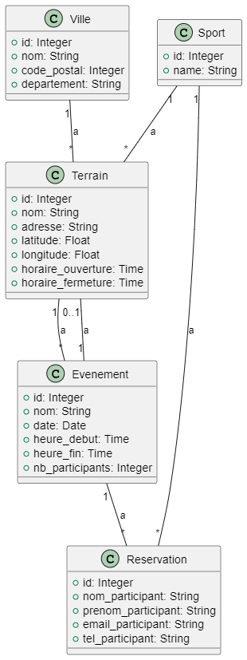

= SocSport
:doctype: book
:pdf-page-size: A4
:pdf-page-layout: single


= ```socsport``` Documentation

== Choix sujet

"SocSport" est une application innovante visant à faciliter la vie active et sociale. Elle permet aux utilisateurs d'organiser facilement des matchs sportifs avec amis, collègues et passionnés. En favorisant un mode de vie sain, renforçant les liens sociaux, facilitant l'organisation d'événements sportifs, créant des communautés et offrant des opportunités commerciales, SocSport se positionne comme bien plus qu'une simple application, intégrant également des aspects technologiques modernes pour une expérience utilisateur optimale.

== Concurrence

Des applications comme SportyHQ, OpenSports, Beballer et Strava peuvent être utilisées pour organiser des événements sportifs et rassembler des communautés autour du sport. 

SocSport se distingue de la concurrence en offrant une expérience unique et conviviale. En effet, notre application permet une réservation gratuite de terrains avec l'ajout facile d'événements sportifs personnalisés. Grâce à une technologie de localisation avancée, les utilisateurs peuvent trouver rapidement les terrains les plus proches. L'interface intuitive, les fonctionnalités sociales avancées et les retours positifs des utilisateurs renforcent notre engagement envers une communauté sportive dynamique. Optez pour SocSport pour une expérience inégalée dans l'organisation d'activités sportives.

= Installation de SocSport

== 0. Prérequis
Assurez-vous d'avoir Python installé sur votre machine avec une version compatible (Python 3.12 ou supérieur recommandé). Vous pouvez vérifier si Python est installé en exécutant `python --version` dans votre terminal. Dans le cas où Python n'est pas installé, vous pouvez le faire en suivant les instructions sur le site officiel de Python : link:https://www.python.org/downloads/[Installation de Python].

== 1. Installation de Flask
Vous pouvez installer Flask en lançant votre terminal de commande en tant qu'administrateur puis en entrant cette ligne de commande :
[source, shell]
----
pip install Flask
----

== 2. Installation de Node.js
Si vous n'avez pas Node.js installé sur votre système, vous pouvez dans un premier temps le télécharger sur le site officiel : link:https://nodejs.org/fr[Installation de Node.js].

== 3. Clonage du projet
Maintenant que Node.js et Flask sont installés, vous pouvez cloner le dépôt Github de SocSport sur votre machine locale en utilisant la commande suivante :
[source, shell]
----
git clone https://github.com/mfrj22/socsport.git
----

== 4. Installation des librairies Python
Pour notre projet, nous avons utilisé différentes bibliothèques Python :

* SQLAlchemy permet d'intégrer une base de données SQL dans notre application Flask.
[source, shell]
----
pip install Flask-SQLAlchemy
----

* PyMySQL permet d'assurer la connectivité et la communication avec notre base de données MySQL.
[source, shell]
----
pip install pymysql
----

* Cryptography est utilisé pour renforcer la sécurité.
[source, shell]
----
pip install cryptography
----

* Geopy gère les opérations de géolocalisation (calcul de distances entre des points géographiques).
[source, shell]
----
pip install geopy
----

* PyTest permet d'exécuter des tests unitaires.
[source, shell]
----
pip install pytest
----

* Coverage permet d'obtenir à la couverture de code et de créer un fichier avec les résultats.
[source, shell]
----
pip install coverage
----

* Python_Dotenv est utilisé pour utliser les variables d'environnement fichier .env.
[source, shell]
----
pip install Python_Dotenv
----

== 5. Installation des modules React
Pour le bon fonctionnement de notre application, nous avons ajouté des modules React :
[source, shell]
----
npm install
npm install react-router-dom
npm install react-slick slick-carousel
----

== 6. Lancement de l'Application
Vous êtes maintenant prêt à lancer l'application ! Utilisez la commande suivante pour démarrer le serveur de développement :
[source, shell]
----
npm start
----

Pour lancer l'API Flask, il vous faudra lancer un terminal depuis la racine du projet puis lancer cette ligne de commande :
[source, shell]
----
python app.py
----

== 7. API 

== OpenWeatherMap API

L'API OpenWeatherMap est intégrée dans SocSport pour fournir des informations météorologiques en temps réel. Voici comment elle est utilisée dans l'application :

* **Objectif :** L'API OpenWeatherMap est utilisée pour obtenir des données météorologiques basées sur les coordonnées géographiques de l'utilisateur.

* **Fonctionnement :** Lorsque l'utilisateur soumet sa position actuelle à l'application, cette dernière envoie une requête à l'API OpenWeatherMap en incluant les coordonnées de l'utilisateur (latitude et longitude). En retour, l'API fournit des informations météorologiques, telles que la description météorologique (ensoleillé, nuageux, pluvieux, etc.) et la température. Ces informations sont ensuite affichées à l'utilisateur pour lui fournir une mise à jour en temps réel sur les conditions météorologiques locales.

* **Avantages :** L'intégration de l'API OpenWeatherMap offre une expérience utilisateur enrichie, permettant aux utilisateurs de planifier leurs activités sportives en fonction des conditions météorologiques actuelles.

== OpenRouteService API (OpenStreetMap)

L'API OpenRouteService (basée sur OpenStreetMap) est utilisée dans SocSport pour fournir des itinéraires et des directions vers les terrains de sport sélectionnés. Voici comment elle est utilisée dans l'application :

* **Objectif :** L'API OpenRouteService est utilisée pour obtenir des itinéraires de conduite entre la position actuelle de l'utilisateur et un terrain de sport sélectionné.

* **Fonctionnement :** Lorsque l'utilisateur sélectionne un terrain de sport et demande des directions, l'application envoie une requête à l'API OpenRouteService. Cette requête inclut les coordonnées de la position actuelle de l'utilisateur et celles du terrain de sport sélectionné. En retour, l'API fournit les coordonnées des points le long de l'itinéraire, permettant à l'application d'afficher les directions de conduite à l'utilisateur.

* **Avantages :** L'utilisation de l'API OpenRouteService améliore l'utilité de SocSport en fournissant des itinéraires pratiques pour que les utilisateurs atteignent rapidement et efficacement les terrains de sport de leur choix.

Ces deux API, OpenWeatherMap et OpenRouteService (OpenStreetMap), sont des éléments clés de l'infrastructure de SocSport, contribuant à une expérience utilisateur complète et offrant des fonctionnalités pratiques pour la planification et la réalisation d'activités sportives.

== 8. Diagramme de classe 



== 9. Diagramme de séquence 

image::models/images/DiagSeq.png[Diagramme de Classe]

== 10. Diagramme entité/association 

image::models/images/DiagEA.png[Diagramme de Classe]
